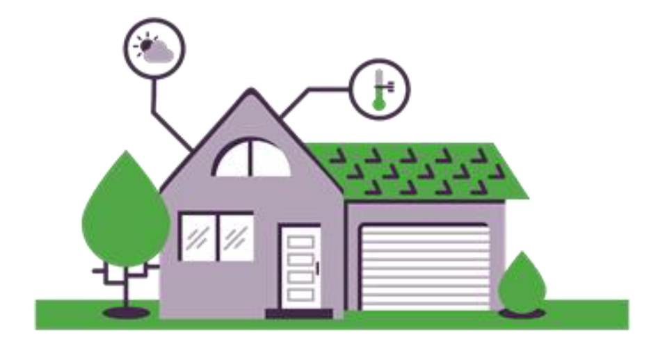

House Energy with MSFT Bonsai
========================================

## Objective

Control the temperature inside of a house according to the desired set temperatures just like a thermostat.



## Sim Package Build + storage on Azure Container Registry

To build your simulator package for sim-scaling on Project Bonsai, use the following `az acr` command, it will also store the container on the registry

```bash
registry_name="your_registry_name"
az acr build --image houseenergy:latest --file Dockerfile --registry $registry_name .
```
Follow these [instructions](https://docs.microsoft.com/en-us/bonsai/guides/add-simulator) to add a simulator to your bonsai workspace 

## Running Locally

Step 1: Register your sim

```bash
python main.py --config-setup True
```
Step 2: connect your registered sim to a brain

```bash
brain_name="your_brain_name"
bonsai simulator unmanaged connect -b $brain_name --action Train --concept-name SmartHome --simulator-name HouseEnergy
```

## States

| State | Units |
| ----- | ----- |
| Tin   | [°C]  |
| Tset  | [°C]  |
| Tout  | [°C]  |

## Actions

| Action | Discrete Value       |
| ------ | -------------------- |
| hvacON | 0 (ON)    or 1 (OFF) |


## Terminal Conditions

- Exceed 288 iterations in an episode
- Exceed > 10°C of desired temperature

## Configuration Parameters

- K
- C
- Qhvac
- schedule_index
- number_of_days
- timestep
- Tin_initial
- max_iterations

### Initial conditions

- Tin
- Tset
- Tout
- hvacON

## Simulator API - Python

- `setup_schedule()`
- `update_hvacON()`
- `update_Tin()`
- `show()`